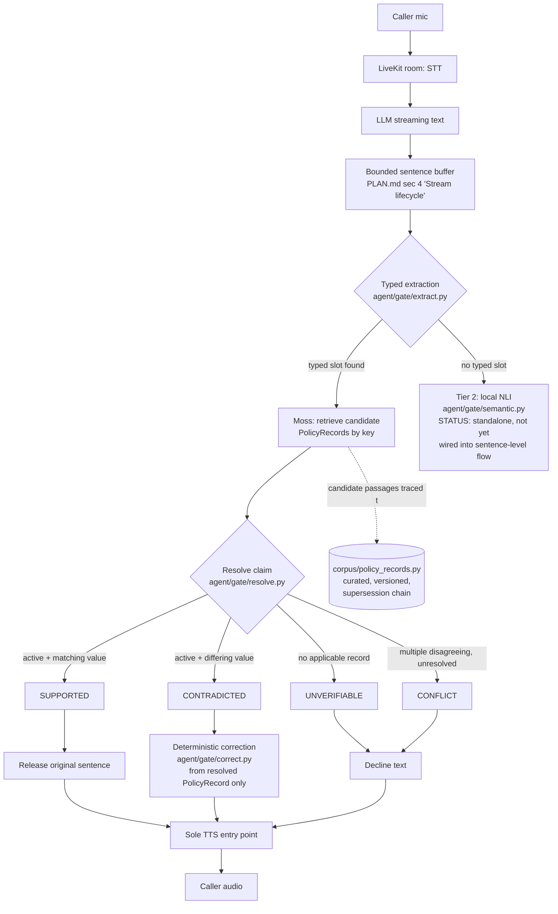

# Architecture — Hesitate

Mandatory submission deliverable (PLAN.md section 23: "architecture diagram showing the retrieval flow").

## Retrieval and verification flow

## What is real today vs. planned

| Component | Status |
|---|---|
| Typed extraction (6 claim families) | Implemented, tested (13/13 benchmark, 15/15 pytest) |
| Structured PolicyRecord resolution: applicability, supersession, conflict | Implemented, tested |
| Deterministic correction from resolved record | Implemented, tested — never uses model's original wrong value |
| Tier 2 local NLI (cross-encoder/nli-deberta-v3-xsmall) | Implemented, benchmarked standalone (4/4 cases, warm p50 ~7ms model-only / ~22ms with wrapper overhead). **Not yet wired into the sentence-level gate** — that requires decomposing a sentence into atomic propositions first (PLAN.md section 10), which needs an LLM call and therefore an API key/account decision |
| Live Moss retrieval | Not connected. `resolve.py` takes a `list[PolicyRecord]` directly so it is testable without a live connection; the adapter that calls Moss and maps its results back to curated PolicyRecords by `source_id` is not yet written — needs a Moss account/API key |
| LiveKit voice pipeline | Not built — needs LiveKit + STT/TTS provider accounts |
| Deployment | Not done — needs hosting account |

This document will be regenerated as those pieces close; it is not written aspirationally ahead of the code.
