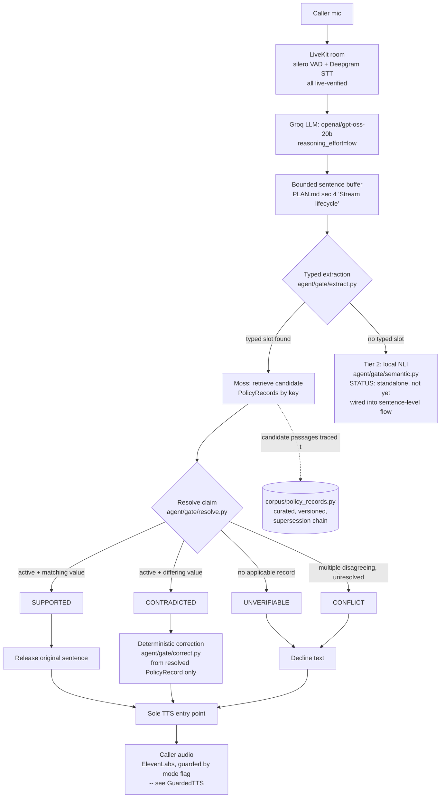

# Architecture — Hesitate

Mandatory submission deliverable (PLAN.md section 23: "architecture diagram showing the retrieval flow").

## Retrieval and verification flow

## What is real today vs. planned

Updated 2026-09-13 after live account integration and a first live voice-pipeline test.

| Component | Status |
|---|---|
| Typed extraction (6 claim families) | Implemented, tested (13/13 benchmark, 15/15 pytest) |
| Structured PolicyRecord resolution: applicability, supersession, conflict | Implemented, tested |
| Deterministic correction from resolved record | Implemented, tested — never uses model's original wrong value |
| Tier 2 local NLI (cross-encoder/nli-deberta-v3-xsmall) | Implemented, benchmarked standalone (4/4 cases, warm p50 ~7ms). **Still not wired into the sentence-level gate** — needs decomposition into atomic propositions (PLAN.md section 10) |
| Live Moss retrieval | **Live and verified.** Real project connected; retrieval genuinely ranks a stale policy document above the current one for the natural patient question (0.99 vs 0.975 similarity, confirmed twice) — the exact scenario the product exists to catch |
| End-to-end (real Moss + real Groq LLM + gate) | **Proven live once** (`tests/test_end_to_end_live.py`): real retrieval surfaces the stale doc, real LLM states it as fact, the gate catches and corrects it in 9.76ms |
| `HesitateAgent` (overrides LiveKit's `tts_node`) | Implemented, unit-tested (4/4) at the text/buffering level |
| LiveKit voice pipeline (STT/VAD/LLM/TTS wired) | **Partially proven live.** Real room connection, real Deepgram STT WebSocket connection, silero VAD all confirmed working against a synthetic caller. **Gap found and not yet closed:** no transcript ever appeared — suspected malformed raw audio frames in the synthetic-caller test script, not in the production path. Needs testing via a real browser + microphone (`call.html`) next |
| TTS quota guard (`GuardedTTS`) | Implemented, tested (2/2) — real ElevenLabs provider is never called unless `HESITATE_TTS_MODE=live` is set explicitly, verified with a deliberately invalid API key |
| Deployment | **Live:** https://hesitate-api.onrender.com (`/health`, `/gate/demo`, `/token`, `/call.html` all confirmed 200 OK). One production bug found and fixed: environment variables were never actually set on the deployed service |
| Dashboard / call UI beyond the bare test page | Not built |

This document is regenerated as pieces close; it is not written aspirationally ahead of the code. See
`COMPETITION.md` for the full evidence ledger with dates and sources.
